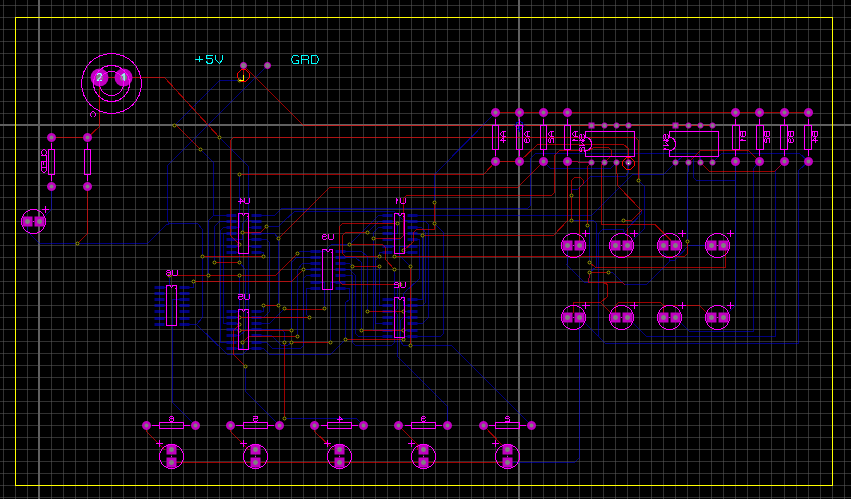
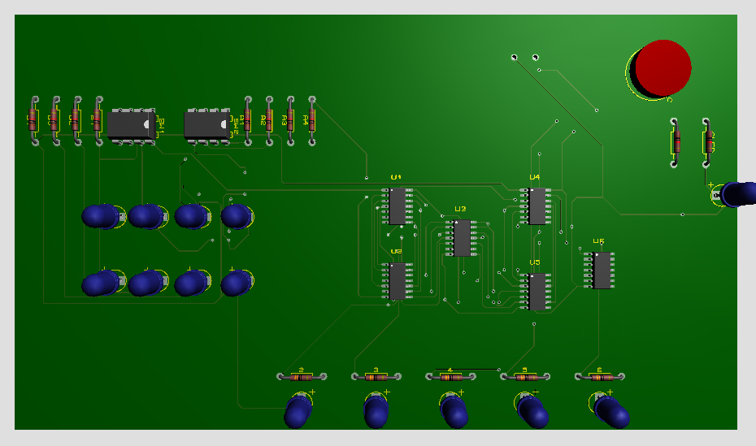

\# 4-Bit Adder/Subtractor Circuit Design

\*\*Author:\*\* Sinan ONA

\*\*Institution:\*\* Muğla Sıtkı Koçman University, Electrical \& Electronics Engineering

\*\*Course:\*\* Logic Design and Circuits Lab

\## 📌 Project Overview

This project involves the design, simulation, and PCB implementation of a 4-bit binary Adder/Subtractor. The circuit utilizes four Full Adders constructed from basic logic gates (XOR, AND, OR) to perform arithmetic operations on two 4-bit binary numbers ($A$ and $B$). A mode switch allows the user to toggle between addition ($A+B$) and subtraction ($A-B$) using the 2's complement method.

\## ⚙️ Features

\* \*\*Dual Mode Operation:\*\* Switchable between Adder (Mode 0) and Subtractor (Mode 1).

\* \*\*Gate-Level Logic:\*\* Implemented using fundamental logic gates (2 XOR, 2 AND, 1 OR per Full Adder) rather than pre-packaged ALU ICs.

\* \*\*Negative Result Indication:\*\* Dedicated LED indicator for negative results in subtraction mode.

\* \*\*PCB Implementation:\*\* Fully routed and visualized PCB design with input DIP switches and output LEDs.

\## 🧠 Theory of Operation

\### 1. Adder Mode (Switch = 0)

In this mode, the circuit performs binary addition. The logic follows the standard Full Adder truth table.

\*\*Boolean Expressions for Addition:\*\*

\* \*\*Sum ($S$):\*\* $$S = A \\oplus B \\oplus C\_{in}$$

\* \*\*Carry Out ($C\_{out}$):\*\* $$C\_{out} = (A \\cdot B) + (C\_{in} \\cdot (A \\oplus B))$$

\### 2. Subtractor Mode (Switch = 1)

The circuit performs subtraction using the \*\*2's complement\*\* method.

\* The operation performed is essentially $A + (-B)$.

\* \*\*Difference ($D$):\*\* $$D = A \\oplus B \\oplus B\_{in}$$

\* \*\*Borrow Out ($B\_{out}$):\*\* $$B\_{out} = (\\neg A \\cdot B) + (B\_{in} \\cdot \\neg (A \\oplus B))$$

\## 🛠️ Hardware \& Schematic

\### Visuals

| Schematic | PCB 3D View |

| :---: | :---: |

|   |  |

\## 🚀 How to Use

1\.  \*\*Power:\*\* Connect to +5V.

2\.  \*\*Input:\*\* Set binary numbers $A$ and $B$ via DIP switches.

3\.  \*\*Mode:\*\* Toggle Switch (0=Add, 1=Subtract).

4\.  \*\*Output:\*\* Read LEDs D1-D4 for result, D5 for Carry/Sign.

