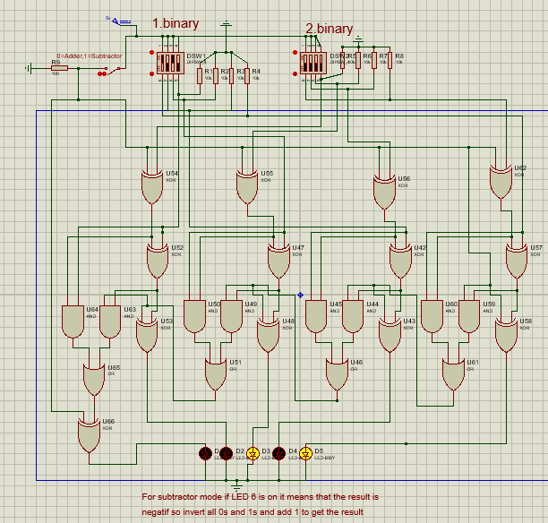

# 4-Bit Adder/Subtractor Circuit Design

**Author:** Sinan ONA
[cite_start]**Institution:** Muğla Sıtkı Koçman University, Department of Electrical & Electronics Engineering [cite: 5]
[cite_start]**Course:** Logic Design and Circuits Lab [cite: 7]

## 📌 Abstract
This repository contains the design documentation, simulation logic, and PCB implementation of a 4-bit binary Adder/Subtractor. [cite_start]The system is designed at the gate level, utilizing a network of fundamental logic gates (XOR, AND, OR) to construct four cascaded Full Adders[cite: 55]. [cite_start]A control switch toggles the circuit between arithmetic addition ($A+B$) and subtraction ($A-B$) using 2's complement logic[cite: 57].

## ⚙️ Technical Specifications
* **Architecture:** 4-Bit Ripple Carry Adder/Subtractor
* **Logic Family:** Gate-level implementation (No dedicated ALU ICs)
* **Operation Modes:**
    * **Mode 0 (Adder):** Standard binary addition.
    * [cite_start]**Mode 1 (Subtractor):** 2's complement subtraction with negative result indication[cite: 51].
* **Input Interface:** 2x 4-bit DIP switches.
* **Output Interface:** 5x LED indicator array (4 Data Bits + 1 Carry/Sign Bit).

## 🧠 Logic & Architecture

### 1. Adder Mode (Select = 0)
In this configuration, the circuit performs standard binary addition. The system follows the boolean logic for a Full Adder:

* **Sum ($S$):** $$S = A \oplus B \oplus C_{in}$$
* **Carry Out ($C_{out}$):** $$C_{out} = (A \cdot B) + (C_{in} \cdot (A \oplus B))$$

### 2. Subtractor Mode (Select = 1)
The circuit utilizes the **2's Complement** method for subtraction ($A - B$). The XOR gates on input $B$ act as controlled inverters. [cite_start]When the mode switch is high, $B$ is inverted, and a carry-in of 1 is added to the LSB[cite: 57].

* **Difference ($D$):** $$D = A \oplus B \oplus B_{in}$$
* **Borrow Out ($B_{out}$):** $$B_{out} = (\neg A \cdot B) + (B_{in} \cdot \neg (A \oplus B))$$

> **Note:** If the MSB LED (Sign Bit) is active during subtraction, the result is negative. [cite_start]The magnitude is obtained by taking the 2's complement of the displayed output[cite: 58].

## 🛠️ Hardware Implementation

### Bill of Materials (BOM)
[cite_start]Based on the schematic design[cite: 68, 74, 81]:

| Component | Quantity | Description |
| :--- | :---: | :--- |
| **Logic Gates** | Multiple | XOR, AND, OR ICs (e.g., 74HC series) |
| **DIP Switches** | 2 | 4-Position for Input A & B |
| **LEDs** | 5 | Visual Output Indicators |
| **Resistors** | 8+ | 10k$\Omega$ (Pull-down), 100$\Omega$ (Current Limiting) |
| **Switch** | 1 | SPST Mode Selector |

### Visuals

| Schematic Diagram | PCB 3D Render |
| :---: | :---: |
|  |  |

## 🚀 Usage Instructions
1.  **Power Up:** Connect the PCB to a regulated **+5V** DC power supply.
2.  **Input Configuration:** Set the two 4-bit numbers ($A$ and $B$) using the DIP switch banks.
3.  **Mode Selection:**
    * **Addition:** Toggle the Mode Switch to **OFF (0)**.
    * **Subtraction:** Toggle the Mode Switch to **ON (1)**.
4.  **Read Output:**
    * **LEDs D1-D4:** Display the binary result.
    * **LED D5:** Indicates **Carry Out** (in Addition) or **Negative Sign** (in Subtraction).
